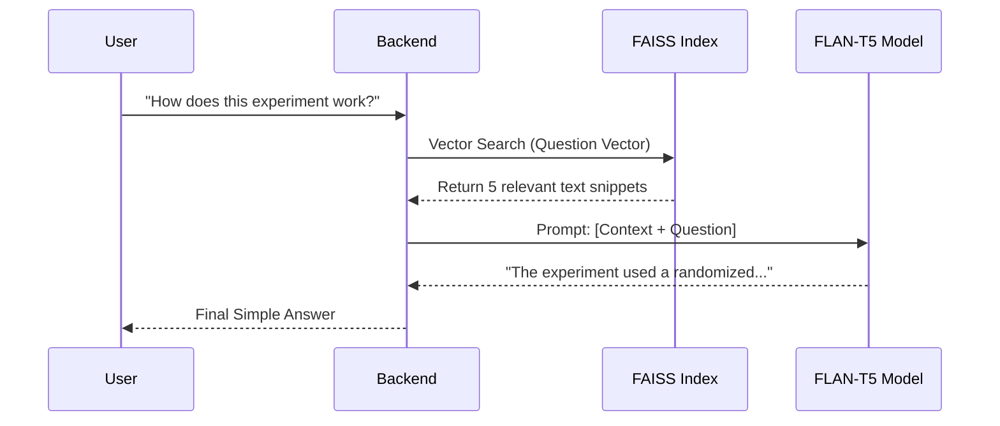

# 🤖 Research Intelligence: AI Module Exhaustive Technical Guide

This document provides a deep-dive into the AI "Brain" of the project. It explains exactly what each file does, the logic behind the algorithms, and why specific AI models were chosen.

---

## 1. 🏗️ The Model Registry: Our AI Engine Room
- **File:** [app/models/model_registry.py](file:///home/santusht/Desktop/Augenblick/MainProject/research-platform/ai-module/app/models/model_registry.py) & [app/models/embedding_model.py](file:///home/santusht/Desktop/Augenblick/MainProject/research-platform/ai-module/app/models/embedding_model.py)
- **Models Used:**
    - **Summarizer:** `distilbart-cnn-12-6`. A smaller, faster version of BART optimized for summary generation.
    - **Reasoning/Q&A:** `google/flan-t5-base`. An instruction-tuned model that is excellent at following prompts and extracting structured data.
    - **Embedder:** `all-MiniLM-L6-v2`. A high-speed sentence transformer that turns text into 384-dimensional vectors for search.
- **Why?** These models were chosen to balance **accuracy** with **speed**, allowing the module to run on standard hardware without requiring massive GPU clusters.

---

## 2. 📂 Service-by-Service Deep Dive

### 📝 Paper Summarizer ([summarizer_service.py](file:///home/santusht/Desktop/Augenblick/MainProject/research-platform/ai-module/app/services/summarizer_service.py))
- **What it does:** Creates a 4-part summary: General Overview, Contributions, Methodology, and Limitations.
- **The Logic:**
    1. **BART for Overview:** It takes the first few chunks of the paper and passes them through the `distilbart` pipeline.
    2. **Structured Extraction:** It uses `FLAN-T5` with targeted prompts (e.g., *"What methodology was used?"*) focused on the first 2000 characters of the paper, where abstracts and introductions live.
- **Why?** General summarizers often miss the "technical" bits. By using BART for the flow and T5 for the facts, we get a summary that is both readable and accurate.

### 💬 Paper Chat & RAG ([paper_chat_service.py](file:///home/santusht/Desktop/Augenblick/MainProject/research-platform/ai-module/app/services/paper_chat_service.py))
- **What it does:** Allows users to "talk" to their PDFs.
- **The RAG Process:**
    1. **Indexing:** Breaks a paper into 500-character chunks, turns them into vectors (`MiniLM`), and stores them in **FAISS**.
    2. **Retrieval:** When you ask a question, the AI converts the question into a vector and finds the **top 5 most similar** text chunks.
    3. **Generation:** It feeds those 5 chunks into `FLAN-T5` as "Context" and asks the model to answer based *only* on that text.
- **Why?** This prevents "Hallucinations." The AI won't make things up; it only answers using the text you uploaded.

### 💡 Insight Extractor ([insight_service.py](file:///home/santusht/Desktop/Augenblick/MainProject/research-platform/ai-module/app/services/insight_service.py))
- **What it does:** Automatically generates research highlights.
- **The Logic:** Focuses on the first 2500 characters and uses a dense prompt to force the model to identify "Research Gaps" and "Novelty."
- **Why?** Researchers often need to skim 20 papers a day. This gives them the "meat" of the paper in 3 seconds.

### 🔍 Plagiarism & Similarity ([plagiarism_service.py](file:///home/santusht/Desktop/Augenblick/MainProject/research-platform/ai-module/app/services/plagiarism_service.py))
- **What it does:** Checks if a new paper overlaps with your existing project library.
- **The Logic:** 
    - It compares every chunk of the new paper against the entire FAISS vector store.
    - It uses a **Bounded Similarity Score**: `1 / (1 + L2_Distance)`.
    - If a section is >85% similar, it flags it as a match.
- **Why?** To ensure research integrity and help identify if two papers in a project are discussing the same experiments.

### 🏷️ Topic & Keyword Engine ([topic_service.py](file:///home/santusht/Desktop/Augenblick/MainProject/research-platform/ai-module/app/services/topic_service.py))
- **What it does:** Extracts representative tags.
- **The Logic:** Not an LLM, but a smart heuristic. It cleans text, removes "Stop Words" (like *the, and, research*), and counts frequent meaningful words with at least 4 characters.
- **Why?** Using an LLM for simple keyword counting is overkill and slow. This method is instant and highly effective for tagging.

---

## 3. ⚙️ RAG Architecture Flow

---

## 4. 🛠️ Memory & Persistence
- **Vector Store:** The FAISS index is saved in the `/data` folder.
- **Paper IDs:** Every chunk is tagged with its source `paper_id` so the AI knows which book it's looking at.
- **Cleanup:** When a paper is deleted in SQL, its vectors should be re-indexed or filtered (managed by the `paper_id` metadata).
