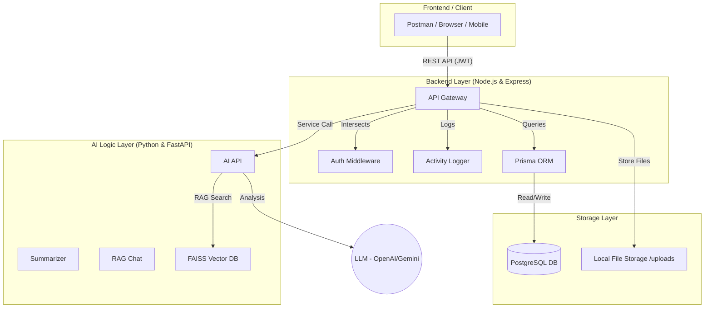

# 🏗️ Research Platform: Central Architecture Overview

This document summarizes the high-level architecture of the entire platform, showing how the different modules interact to provide a seamless research experience.

---

## 1. 🌐 The Big Picture

The platform is divided into three main layers: The **Client**, the **Business Logic (Backend)**, and the **Intelligence Engine (AI)**.

---

## 2. 🔄 Request Lifecycle (End-to-End)

How a complex request (like "Summarize a PDF and save insights") flows through the system:

1.  **Client:** Sends a `POST` request with the PDF metadata.
2.  **Backend (Node.js):** 
    - `AuthMiddleware` verifies the user.
    - `PaperService` saves the paper record to **PostgreSQL**.
    - `AIService` sends the text to the **Python Module**.
3.  **AI Module (Python):** 
    - `SummarizerService` processes the text through an **LLM**.
    - Returns a JSON summary.
4.  **Backend (Node.js):** 
    - Receives the summary.
    - `InsightService` creates a new record in **PostgreSQL**.
    - `ActivityLogger` records "User summarized Paper X".
5.  **Client:** Receives the final success response.

---

## 🏠 3. Module Responsibilities

| Module | Responsible For | Local URL (Dev) |
| :--- | :--- | :--- |
| **Backend** | Users, Projects, Experiments, Security, File Links. | `http://localhost:5000` |
| **AI Module** | Summaries, RAG Chat, Insight Extraction, Vector Search. | `http://localhost:8000` |
| **PostgreSQL** | Permanent long-term storage of all structured data. | `localhost:5432` |

---

## 🔗 4. Documentation Links

For deeper dives into each component:
- 🚀 **[Backend Documentation](file:///home/santusht/.gemini/antigravity/brain/25a657c6-8caf-4abe-8d9f-83d767c9d6f7/backend_documentation.md)**
- 🤖 **[AI Module Documentation](file:///home/santht/.gemini/antigravity/brain/25a657c6-8caf-4abe-8d9f-83d767c9d6f7/ai_module_documentation.md)**
- 📊 **[Database Documentation](file:///home/santusht/.gemini/antigravity/brain/25a657c6-8caf-4abe-8d9f-83d767c9d6f7/database_documentation.md)**
