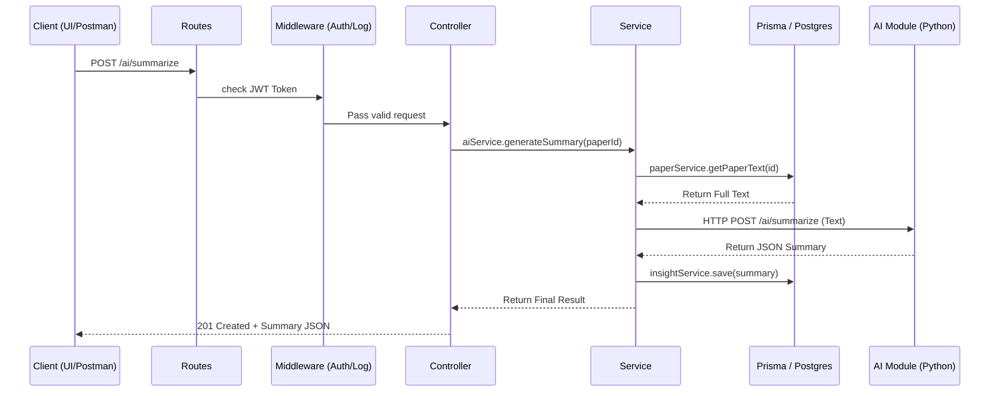

# 🚀 Research Platform: Exhaustive Backend Architecture (Node.js/Express)

This document provides a complete, deep-dive explanation of the backend service. It explains **which** files do **what**, **why** they are structured this way, and **how** they are all linked together.

---

## 🏗️ 1. The Design Pattern: Controller-Service-Route

We use a **Layered Architecture**. This means we separate the "how the user talks to us" from the "what the computer actually does."

### Component Roles:
1.  **Routes (`/routes/*.js`):** The "Doors." They only define the URL and which middleware (like Auth) can pass through.
2.  **Controllers (`/controllers/*.js`):** The "Receptionists." They take the user's request, extract the data, and send it to a Service. They don't do math or DB calls; they just manage the conversation.
3.  **Services (`/services/*.js`):** The "Engineers." This is where the **Business Logic** lives. Calculating insights, checking paper overlaps, and talking to Prisma happens here.
4.  **Middleware (`/middleware/*.js`):** The "Guards." They check IDs (JWT tokens) or log what happened before the request reaches the receptionist.

---

## 🗺️ 2. Comprehensive File-by-File Breakdown

### 🔐 Authentication & Security (The Shield)
*   **[userService.js](file:///home/santusht/Desktop/Augenblick/MainProject/research-platform/backend/services/userService.js):** Handles password hashing (using `bcrypt`) and user creation.
*   **[sessionService.js](file:///home/santusht/Desktop/Augenblick/MainProject/research-platform/backend/services/sessionService.js):** Manages Refresh Tokens and Session tracking. It's the reason we can revoke access instantly.
*   **[authMiddleware.js](file:///home/santusht/Desktop/Augenblick/MainProject/research-platform/backend/middleware/authMiddleware.js):** Verifies the JWT token on every protected request.
*   **[rateLimiter.js](file:///home/santusht/Desktop/Augenblick/MainProject/research-platform/backend/middleware/rateLimiter.js):** Prevents brute-force attacks by limiting how many times you can call an API in a minute.

### 📁 Research Projects & Workflow (The Workspace)
*   **[projectController.js](file:///home/santusht/Desktop/Augenblick/MainProject/research-platform/backend/controllers/projectController.js) / [projectService.js](file:///home/santusht/Desktop/Augenblick/MainProject/research-platform/backend/services/projectService.js):** The core of the workspace. Manages project creation, membership (who can see what), and visibility.
*   **`workflowStageStage.js` / [workflowItemService.js](file:///home/santusht/Desktop/Augenblick/MainProject/research-platform/backend/services/workflowItemService.js):** Implements the Kanban logic. Items (papers/notes) are moved between stages like "Reading" or "Analyzed."
*   **[experimentController.js](file:///home/santusht/Desktop/Augenblick/MainProject/research-platform/backend/controllers/experimentController.js) / [experimentService.js](file:///home/santusht/Desktop/Augenblick/MainProject/research-platform/backend/services/experimentService.js):** Tracks formal research steps. It links Results and Iterations to a central Experiment goal.

### 📚 Literature & AI Bridge (The Intelligence)
*   **[paperController.js](file:///home/santusht/Desktop/Augenblick/MainProject/research-platform/backend/controllers/paperController.js) / [paperService.js](file:///home/santusht/Desktop/Augenblick/MainProject/research-platform/backend/services/paperService.js):** Manages the library. It talks to the **Semantic Scholar API** to fetch external data and saves it locally.
*   **[aiController.js](file:///home/santusht/Desktop/Augenblick/MainProject/research-platform/backend/controllers/aiController.js) / [aiService.js](file:///home/santusht/Desktop/Augenblick/MainProject/research-platform/backend/services/aiService.js):** This is the bridge to the **Python AI Module**. It sends chunks of text via HTTP to the FastAPI server and formats the answers for the user.
*   **[insightService.js](file:///home/santusht/Desktop/Augenblick/MainProject/research-platform/backend/services/insightService.js):** A specialized service that stores "Golden Nuggets" of info extracted by the AI into the database.

### 🔗 The Master Connector (The Glue)
*   **[linkService.js](file:///home/santusht/Desktop/Augenblick/MainProject/research-platform/backend/services/linkService.js):** Implements **Polymorphic Linking**. It allows a single table to connect any source (Paper, Note, Dataset) to any target (Experiment, Project).
*   **[conceptService.js](file:///home/santusht/Desktop/Augenblick/MainProject/research-platform/backend/services/conceptService.js):** Manages the brainstorming nodes and traditional relationship links for visual graphs.

### 📊 System Monitoring (The Logs)
*   **[activityService.js](file:///home/santusht/Desktop/Augenblick/MainProject/research-platform/backend/services/activityService.js):** Powers the "Recent Activity" feed. It's called by the [activityLogger.js](file:///home/santusht/Desktop/Augenblick/MainProject/research-platform/backend/middleware/activityLogger.js) middleware.
*   **[searchHistoryService.js](file:///home/santusht/Desktop/Augenblick/MainProject/research-platform/backend/services/searchHistoryService.js):** Records every query a user makes, allowing for "Recent Searches" functionality.

---

## 🔄 3. Detailed Request Flow Diagram

---

## 📂 4. Shared Utilities & Config
*   **[app.js](file:///home/santusht/Desktop/Augenblick/MainProject/research-platform/backend/app.js):** The central assembly point. Every route and global middleware is registered here.
*   **[server.js](file:///home/santusht/Desktop/Augenblick/MainProject/research-platform/backend/server.js):** The physical entry point that starts the network listener.
*   **[config/prisma.js](file:///home/santusht/Desktop/Augenblick/MainProject/research-platform/backend/config/prisma.js):** A singleton instance of the Prisma Client to ensure we don't open too many database connections.
*   **`uploads/` (Folder):** The physical storage for your PDFs and Images (Development mode).

---

## 💡 Why this structure?
- **Testability:** You can test the `summarizerService` without ever starting the Express server.
- **Maintenance:** If you want to change how "Experiments" are saved, you only edit [experimentService.js](file:///home/santusht/Desktop/Augenblick/MainProject/research-platform/backend/services/experimentService.js), and nothing else breaks.
- **Security:** By centralizing `authMiddleware`, we ensure no "forgotten" routes are left open to the public.
