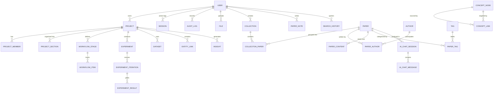

# 📊 Research Platform: Exhaustive Database & Schema Documentation

This document provides a detailed breakdown of **every table** in the research platform database, explaining their purpose, why they exist, and how they relate to each other.

---

## 🗺️ 1. Complete Entity Relationship Diagram (ERD)

This diagram shows how every piece of data in the system connects to the others.

---

## 🏗️ 2. Identity, Access & Security
These tables handle who is using the system and how they are monitored.

| Table | Purpose | Why was it used? | Relationships |
| :--- | :--- | :--- | :--- |
| **User** | The central person entity. | To manage logins, permissions (Roles), and ownership of every other piece of data. | Connects to almost everything as an owner or creator. |
| **Session** | Stores active login sessions. | Used for **Bodyless Logout**. By tracking `sessionId`, we can revoke access from the server even if the user still has a token. | Belongs to a **User**. |
| **AuditLog** | A "Black Box" recorder of actions. | For accountability. It logs every mutation (Create/Update/Delete) with metadata about what changed. | Optional link to **User**. |
| **ApiLog** | System performance monitor. | To track API latency, IP addresses, and status codes for health monitoring. | Independent. |

---

## 📚 2. Literature & Knowledge Base
The heart of the research platform—managing papers, authors, and text.

| Table | Purpose | Why was it used? | Relationships |
| :--- | :--- | :--- | :--- |
| **Paper** | Metadata for a research article. | To store bibliographic info like DOI, Title, and Year. | Link to **Authors**, **Tags**, and **Collections**. |
| **Author** | Information about researchers. | To avoid duplicating names and to track ORCIDs and affiliations. | Many-to-Many with **Paper**. |
| **PaperAuthor** | Joins Papers and Authors. | Required because one paper has many authors, and one author writes many papers. | Junction table for **Paper** and **Author**. |
| **PaperContent** | The raw data of the paper. | To store the extracted `fullText`. Kept separate from [Paper](file:///home/santusht/Desktop/Augenblick/MainProject/research-platform/backend/controllers/tagController.js#12-21) for database performance. | **One-to-One** with **Paper**. |
| **Tag** | Flexible categorization. | To allow users to group papers by topics (e.g., "AI", "Quantum"). | Many-to-Many with **Paper**. |
| **Collection** | User-defined folders. | To organize research into specific topics or sub-topics. | Belongs to a **User**. |
| **CollectionPaper** | Links Papers to Folders. | This allows a single paper to exist in Multiple collections without duplicating data. | Junction for **Collection** and **Paper**. |

---

## 🧬 3. Project & Research Workflow
How users actually "work" and "experiment" in the platform.

| Table | Purpose | Why was it used? | Relationships |
| :--- | :--- | :--- | :--- |
| **Project** | The primary workspace. | Everything a user does (experiments, links, notes) lives inside a project. | Owned by **User**. Contains **Experiments**, **Links**, etc. |
| **ProjectMember** | Collaboration control. | To allow multiple users to work on the same project with different roles (Admin/Guest). | Links **User** to **Project**. |
| **WorkflowStage** | Steps in a project (e.g., "Reading", "Testing"). | To create a Kanban-style pipeline for research progress. | Belongs to a **Project**. |
| **WorkflowItem** | A specific task or entity in a stage. | To track the "status" of a specific paper or experiment in the pipeline. | Belongs to a **Stage** and a **Project**. |
| **Experiment** | Research documentation. | To formalize the scientific process (Objective -> Methodology -> Result). | Belongs to a **Project**. |
| **ExperimentIteration** | Versions of a test. | Research is repetitive. This tracks trial 1, trial 2, etc. | Belongs to an **Experiment**. |

---

## 🧠 4. Knowledge Graph & AI Logic
These tables turn raw data into connected intelligence.

| Table | Purpose | Why was it used? | Relationships |
| :--- | :--- | :--- | :--- |
| **ConceptNode** | Brainstorming bubbles. | To allow visual mapping of ideas (like a Mind Map). | Belongs to a **Project**. |
| **ConceptLink** | Connections between ideas. | To show "A leads to B" or "A contradicts B" in a graph. | Connects two **ConceptNodes**. |
| **EntityLink** | **Polymorphic Master Link.** | This is the "Glue". It can link a Paper to an Experiment or a Note to a Dataset. | Poly-link via `sourceId` and `targetId`. |
| **Insight** | Extracted knowledge. | To store "Ah-ha!" moments found by AI or the human user. | Linked to **Paper**, **Experiment**, or **Project**. |
| **AIChatSession** | Q&A History. | To persist conversations between a researcher and an AI about a specific paper. | Links **User** to **Paper**. |
| **AIChatMessage** | Individual chat bubbles. | To store the context of a conversation for RAG (Retrieval Augmented Generation). | Belongs to a **ChatSession**. |

---

## 📊 5. Analytics & History
Tracking user behaviors and system costs.

| Table | Purpose | Why was it used? | Relationships |
| :--- | :--- | :--- | :--- |
| **UserActivity** | A timestamped feed of "User did X". | To show a "What's New" feed to the user. | Belongs to a **User**. |
| **SearchHistory** | Remembers recent queries. | To help users quickly jump back to a previous search topic. | Belongs to a **User**. |
| **AILog** | Token and Cost tracking. | To monitor how much the AI module is being used and which models are most expensive. | Optional link to **User**. |

---

## 🛠️ Relational integrity
- **Cascades:** Most models have relational constraints. If you delete a **Project**, its **WorkflowStages** and **Experiments** are automatically cleaned up to prevent "Ghost" data.
- **Enums:** We use Enums for things like `UserRole` (ADMIN/USER) and `Visibility` (PUBLIC/PRIVATE) to ensure the database only ever contains valid settings.
